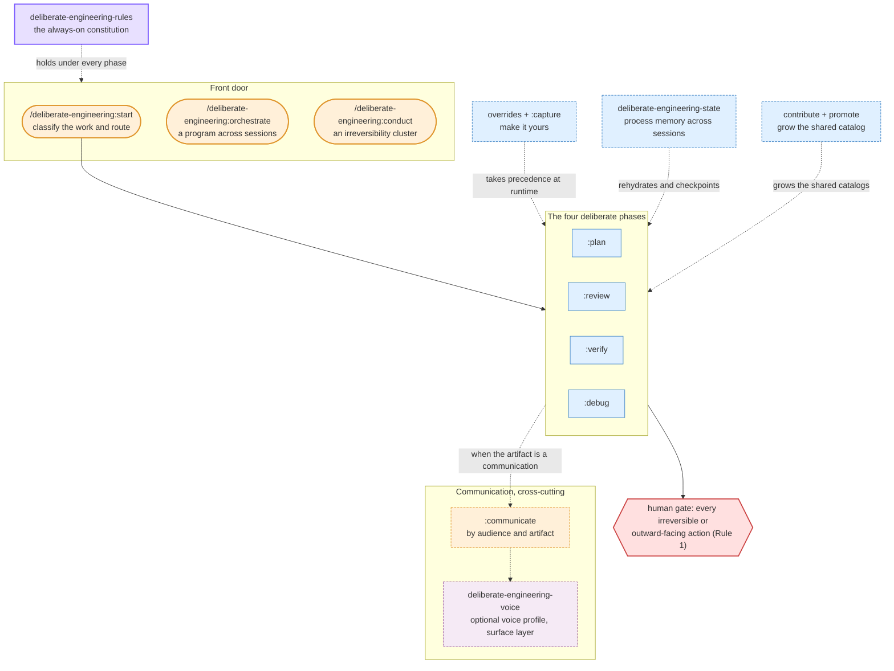

# deliberate-engineering

*Engineering discipline for AI-assisted development. Less vibe coding, more deliberate craft.*

## What it is

Coding agents are good at *acting*. `deliberate-engineering` makes them good at *judging how much*: sizing each change to its risk, reversibility, and reach; applying the review, verification, and planning lenses that fit *this* case; and checking that "done" holds against reality before moving on. It is a thin **judgment layer** on top of your agent's raw capability, not another how-to engine.

Left to its defaults, an agent gives a one-line change to a money calculation the same effort as a typo fix, and can report "done" before anything met reality, not from carelessness, but because nothing told it this change was different. This layer is what tells it: it classifies the work first, then decides *how much* ceremony the change has earned, *which* lenses it actually calls for, and *whether* the result is really true. And it stops at a human gate for anything irreversible or outward-facing.

One mental model runs across the whole lifecycle, and it is a **ruler**: depth is set by the cost of being wrong, never by line count. Each phase classifies on its own axes (planning and review on risk, reversibility, requirement clarity, and reach):

| Phase | Selector | The question it answers |
|---|---|---|
| **Plan** | `planning-strategy-selector` | What's worth building, and how much process does it deserve? |
| **Review** | `review-strategy-selector` | Which lenses does *this* change actually call for? |
| **Verify** | `verification-strategy-selector` | Is it true against reality, and what's my evidence? |
| **Debug/Operate** | `debug-operate-strategy-selector` | A live system is misbehaving and I have no reliable expectation. Now what? |

Planning decides what to build; review reasons about the artifact; verification confronts reality; and debug/operate takes over when a live system misbehaves and no reliable expectation holds. Two siblings handle scale beyond a single pass, `:orchestrate` across many sessions and `:conduct` across a cluster of irreversible steps, and a cross-cutting communication layer tunes what you write for its reader (see [What's inside](#whats-inside)).

## See it in action

Ask for something risky and it sizes the work *before* diving in. For "implement field X on the billing model," instead of charging ahead it leads with its judgment:

> **Genre:** change to an existing system. **Axes:** clarity medium, risk high (billing), reversibility low, reach wide.
> **Sequence:** plan → build → review → verify, full ceremony.
> **Skipping:** nothing (high risk allows no shortcut).
> **Gate (Rule 1):** I stop before deploy/merge for you to trigger. Starting with the **plan** phase.

For a typo fix it does the opposite, and says so: "trivial and safe, single phase, no ceremony." Calibration runs both ways; the point is that the depth is a deliberate, visible decision, not an autopilot default.

## Install

Inside Claude Code:
```claude
/plugin marketplace add lucasfugisawa/deliberate-engineering
/plugin install deliberate-engineering@deliberate-engineering
/reload-plugins
```

or in terminal:
```bash
claude plugin marketplace add lucasfugisawa/deliberate-engineering
claude plugin install deliberate-engineering@deliberate-engineering
```

### Keeping it up to date

New lenses, rules, and fixes ship as version bumps. To receive them automatically, enable auto-update for the marketplace. Auto-update is a property of the *marketplace* (not the individual plugin), and for third-party (non-official) marketplaces Claude Code leaves it **off by default**, by design: it never updates third-party code without your consent. Turn it on once:

`/plugin` → **Marketplaces** tab → select `deliberate-engineering` → **Enable auto-update**.

With auto-update off, you can still update manually from the same `/plugin` menu whenever a new version is available.

**Recommended companion:** install [`superpowers`](https://github.com/obra/superpowers) (Jesse Vincent) alongside it. `deliberate-engineering` owns the *judgment* and delegates the *method* (TDD, systematic debugging, plan execution) to whatever workflow engine you have; `superpowers` is the one I recommend. With no dedicated engine the judgment layer still works: it classifies the work, calibrates the ceremony, and applies the rules and lenses, then delegates execution to whatever is present, down to Claude Code's built-in abilities.

### Optional: make the deliberate layer always-on

Skills load when the model judges them relevant to the task. If you want the layer engaged on *every* engineering session (routing through `/deliberate-engineering:start` with the standing rules underneath, the way I run it), add a short block to your personal `~/.claude/CLAUDE.md`. Append it idempotently from your shell (bash/zsh, macOS/Linux); it's safe to run more than once and won't duplicate the block:

```bash
grep -q 'deliberate-engineering:begin' ~/.claude/CLAUDE.md 2>/dev/null || cat >> ~/.claude/CLAUDE.md <<'EOF'

<!-- deliberate-engineering:begin -->
## Deliberate-engineering (always-on for engineering work)
On software-engineering tasks (writing, reviewing, debugging, planning,
migrating, shipping, or operating code with real consumers, risk, or
irreversibility), begin by invoking `/deliberate-engineering:start` (the
`deliberate-engineering-router`) to classify the work and route to the right
phase, not just on description match. The `deliberate-engineering-rules` skill
is the always-on constitution underneath: it holds on every engineering task
regardless of phase, and the router cites it rather than replacing it. When
the next thing you produce is an engineering communication (a PR
description, a review comment, a work item, a message, an email), consult
`communication-collaboration-selector` and, with it,
`deliberate-engineering-voice`; engineering communications only, never your
own replies to me in this conversation. Skip the router and the rules for
research, prose, ad-hoc analysis, disposable no-consumer scripting, and
non-technical work.
<!-- deliberate-engineering:end -->
EOF
```

**Prefer to paste it by hand?** Copy everything from `<!-- deliberate-engineering:begin -->` through `<!-- deliberate-engineering:end -->` in the block above into your `~/.claude/CLAUDE.md`. **Already have an older block?** The snippet is guarded on that begin marker, so it appends nothing when a block is already present: it will not update one. If your file carries an earlier version, replace the content between the two markers by hand.

This is your machine's choice, never a requirement of the plugin: it only changes *when* the router and rules fire on your machine. To undo it, see [Uninstall](#uninstall).

The nine rules are the small always-on core; everything else, the lenses and catalogs, loads just-in-time when the work calls for it, never as a wall of text in your context.

## Getting started

Not sure where to begin? Run `/deliberate-engineering:start` and describe the work: it's the front door. It classifies the work, names the phases and the ceremony they earn, and routes you to the right phase. When you already know where you are, call a phase directly: `:plan`, `:review`, `:verify`, `:debug`.

### Documentation map

- **[Guides](docs/guides/README.md)**: step-by-step walkthroughs, indexed by situation: [the deliberate flow](docs/guides/deliberate-flow.md) (the everyday journey), [orchestrate](docs/guides/orchestrate.md) (a program across sessions), [conduct](docs/guides/conduct.md) (an irreversibility cluster), [capture](docs/guides/capture.md) (your overrides), [voice-build](docs/guides/voice-build.md) (your voice profile).
- **[Architecture & usage](docs/architecture-and-usage.md)**: the concepts and how the pieces fit together, with diagrams.
- **[CONTRIBUTING](CONTRIBUTING.md)**: the author flow, contributing a lens to the shared catalog.
- **[CHANGELOG](CHANGELOG.md)**: what shipped, version by version.

## What's inside

A standing-rules skill, a front-door router with two siblings (an across-session orchestrator and an irreversibility-cluster conductor), four phase selectors backed by four read-on-demand catalogs, one cross-cutting communication selector, a personal override layer, an optional voice profile layer with a guided path to build one, a process-state working-note, and an author contribution flow, plus twelve commands.



- **`deliberate-engineering-rules`**: nine standing rules held across every phase: the human keeps the trigger on irreversible and outward-facing actions, claims are checked against primary evidence before they're endorsed, recommendations arrive as a reasoned pick rather than a bare menu, durable state is checkpointed before compacting, and nothing ships the reader can't resolve. Scoped to software work; quiet on research, prose, and ad-hoc analysis.
- **`deliberate-engineering-router`** (`:start`): the front door: it classifies the work, names the phase sequence and the ceremony it earns, and routes to the matching selector. It recommends rather than forces; the only hard stop is the human gate on irreversible actions.
- **`deliberate-engineering-orchestrate`** (`:orchestrate`): the router's across-session sibling, for a program too large for one session. It decomposes the work into units, dispatches each to a fresh worker session, verifies every return against primary evidence in a separate context, and tracks the whole program behind an always-current recovery anchor any fresh session can resume from. Deliberately thin; skip it for work that fits one session. The walkthrough is the [orchestrate guide](docs/guides/orchestrate.md).
- **`deliberate-engineering-conduct`** (`:conduct`): the sibling for an irreversibility cluster (a merge cascade, a deploy chain, a batch of production data mutations, a teardown). It runs the cluster from a contract that re-derives world state before every gate, bounds each irreversible step with a dry-run and a blast-radius limit, and queues each irreversible action for you to trigger. The agent conducts; you pull every trigger (Rule 1). The walkthrough is the [conduct guide](docs/guides/conduct.md).
- **Four phase selectors + catalogs**: `:plan`, `:review`, `:verify`, `:debug`. Each classifies the work, then pulls only the matching lenses from its catalog (read on demand, never all at once).
- **`communication-collaboration-selector`** (`:communicate`): cross-cutting, not a phase: when the artifact is a *communication* (a PR description, a review comment, a stakeholder message, a writeup of alternatives), it classifies by audience and artifact and applies the matching lenses. Consult it from inside any phase.
- **`deliberate-engineering-voice`**: the read side of an optional personal voice profile. It applies as the surface layer over whatever the communication selector decided (the lenses decide what the message must accomplish, the profile decides how it sounds), loads only what the draft needs, names the files it loaded, and does nothing when the profile directory is absent. Build a profile with the guided **`:voice-build`** flow. See [Sound like yourself](#sound-like-yourself).
- **Make it yours**: a personal override layer lets your own practice take precedence over any shipped lens or rule; `/deliberate-engineering:capture` distills a session into ready-to-paste override blocks. See [Make it yours](#make-it-yours).
- **`deliberate-engineering-state`**: a consulted-only skill that owns a per-work-unit working-note, so process state (phase sequence, current phase, chosen rituals, open pendings, and the decisions and why) survives across sessions. The router and Rule 6 delegate to it to rehydrate on resume and checkpoint as work proceeds.
- **For contributors**: `/deliberate-engineering:contribute` and `:promote` grow the *shared* catalog from a local clone of this repo (generalize-at-capture, a blocking leak-audit, append-only numbering, and a stop before publish). This is the author side, distinct from your personal overrides; see [`CONTRIBUTING.md`](CONTRIBUTING.md).

<details>
<summary><strong>The four phase catalogs in detail</strong> (116 strategies total; the cross-cutting communication catalog adds seven lenses)</summary>

- **Review: 55 strategies** in five groups: process / meta-review (14), verification & evidence (7), failure & contradiction reasoning (6), engineering-quality lenses (13), and reviews beyond back-end (15). Classifies your change by risk, reversibility, requirement clarity, and reach, then selects the lenses that fit.
- **Verification: 24 strategies** in five groups: evidence & ground truth (6), local & pre-merge (6), staged promotion & rollout (5), post-deploy production verification (5), and operational data-mutation verification (2). For establishing something is *actually* true, with evidence from running systems, not just plausible on paper. Review asks "does this look correct?"; verification asks "is it correct, and what's my evidence?"
- **Planning: 20 strategies** in six groups: scope / anti-over-engineering (4), ground the plan in reality (4), calibrate ceremony to risk (2), slice & sequence (3), capture the plan (4), and disambiguation / readiness (3). For *before* code exists: deciding what work is worth doing and how much process it calls for. It delegates the *how-to-plan* discipline to your workflow engine.
- **Debug/Operate: 17 strategies** in five groups: trust the evidence (3), diagnose under uncertainty (2), respond under pressure (4), keep the signal healthy (5), and learn from the failure (3). For when a *live system* misbehaves and you must diagnose under uncertainty and respond. Verification confirms an expectation you already hold; this is discovery under failure, and it delegates the debugging *method* to your workflow engine.

</details>

## Make it yours

The plugin is opinionated, and it's meant to become yours. A personal override file takes precedence over any shipped lens or rule, addressed by stable id (`review #35`, `verify #14`, `rule 2`): disable one you don't want, annotate one with a note of your own, or add your own strategy or rule. The agent always declares when an override changed what it did, and you can even loosen a safety rule, which it honors while calling out the raised autonomy. It's opt-in: no file, no change.

You don't have to write it by hand: `/deliberate-engineering:capture` (or just ask) distills the session you just had into ready-to-paste blocks, appended only on your approval.

The walkthrough is the **[capture guide](docs/guides/capture.md)**; the exact override format and an example are in [Architecture & usage](docs/architecture-and-usage.md).

## Sound like yourself

The lenses tune a message to its reader. What they can't do is make it sound like *you*: by default every PR description, review comment, ticket, message and email comes out in the same LLM register. An optional voice profile at `~/.claude/deliberate-engineering/voice/` helps it sound a lot more like you, and it's opt-in exactly the way overrides are: no directory, no change in behavior.

The profile is a small directory of your own writing patterns, not a prompt. It shapes only the *surface*, how the message sounds, never what a lens decided the message must accomplish; where the two meet, the lens wins on substance and the profile on voice.

To build one, follow the **[voice-build guide](docs/guides/voice-build.md)**: `/deliberate-engineering:voice-build` is a guided, resumable flow that takes you from identifying your communication archetypes through collection, analysis, and synthesis to a finished profile, keeping the two steps that need your judgment (the style interview and the blind A/B) in your hands. The full format lives in the skill's [contract](plugins/deliberate-engineering/skills/deliberate-engineering-voice/contract.md); the underlying method in its [bootstrap guide](plugins/deliberate-engineering/skills/deliberate-engineering-voice/bootstrap.md).

Nothing personal ships here. The plugin carries the mechanism, the contract, the template and the method; every profile, including mine, is private content on its author's own machine.

## Scope & boundaries

`deliberate-engineering` is a **horizontal** layer: the judgment that holds across every domain (how to classify risk, calibrate ceremony, verify claims, and decide deliberately). It deliberately stops where domain *depth* begins, and that boundary is the design, not a gap. Process judgment is the same whether you're shipping an API, a database schema, or a mobile screen, so this layer stays transferable across all of them, and folding in any one domain's depth would only make it less so.

So it does not carry domain-specific knowledge: API design, data modeling, performance tuning, observability, security hardening, mobile, front-end, and the rest. At the edge where that depth matters, it does the honest thing: it names what it doesn't carry and points you to bring your own domain expertise, rather than fake a competence it doesn't have. That is the same discipline the rules ask of the agent (Rule 7: name the edge of what you know), turned on the plugin itself.

The same honesty applies to its platform reach: it ships as a Claude Code plugin, and that is the honest scope today. It doesn't claim to run on other agents or IDEs, and it removes nothing, coexisting with whatever review and workflow tooling you already run.

## Uninstall

Both steps are independent, and neither edits your code:

1. **Disable or remove the plugin** via `/plugin`: that's the whole product.

If you ran multi-phase or multi-session work, the plugin will have written a working-note to keep its place across context boundaries: `.deliberate/state/` in the repository root when it can confirm that directory is ignored by your VCS, and `~/.claude/deliberate-engineering/state/` otherwise. It says which location it used every time it reads or writes one. Removing the plugin leaves those notes where they are; delete the directory if you want them gone.
2. **If** you added the optional always-on block to your personal `~/.claude/CLAUDE.md`, delete it: everything from `<!-- deliberate-engineering:begin -->` through `<!-- deliberate-engineering:end -->`, inclusive. Removing it is unrelated to disabling the plugin; the router and rules then load only on description match, like any normal skill.

## License

MIT
