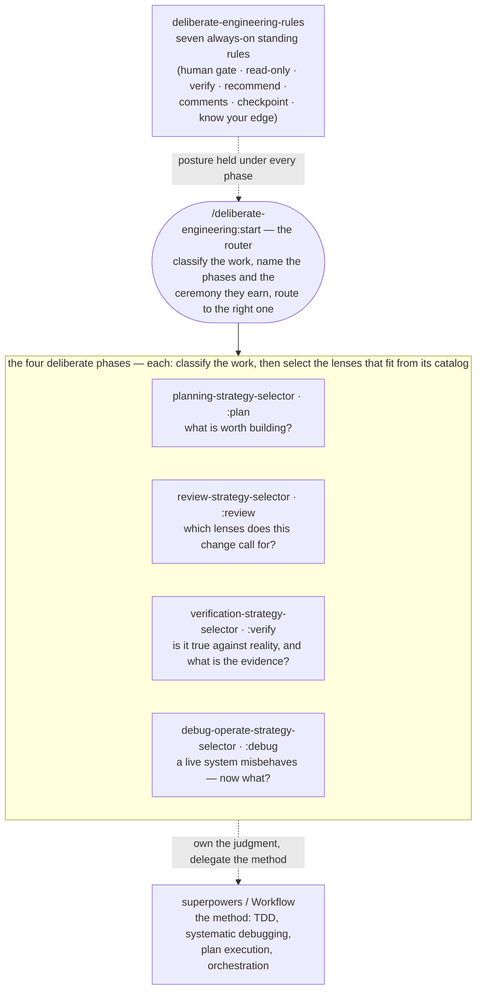
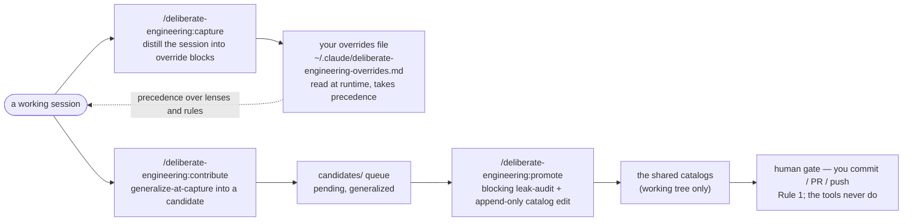

# Architecture & usage

This is the map and the manual for `deliberate-engineering`: what the pieces are, how they fit together, and how to drive each flow. It is written for two readers — the human adopting the plugin, and the agent running it (which reasons better from *what you're trying to do* than from a list of parts). For why the plugin is scoped the way it is, see the README's *Scope & boundaries*; for install and uninstall, see the [README](../README.md).

## How it fits together

The plugin is a thin layer of judgment over a workflow engine. Two views: the lifecycle flow (how engineering work moves through it) and the extensibility cycle (how you personalize it and grow the shared catalogs).

### The lifecycle flow

- **The rules are the constitution.** Seven standing postures held across every phase and never switched off during engineering work. They set *how you behave*; everything below sets *where you start and what you do*.
- **The router is the front door** (`/deliberate-engineering:start`). It classifies the work, names the phase sequence and the ceremony each phase earns, and routes — recommending, never forcing. The only hard stop is the Rule 1 human gate on an irreversible or outward-facing action.
- **The four phases share one pattern:** classify the work, then read only the lenses that fit from that phase's catalog (never the whole catalog at once). Planning decides what to build; review reasons about the artifact; verification confronts reality; debug/operate takes over when a live system misbehaves and no reliable expectation holds.
- **The method is delegated.** `superpowers` (TDD, systematic debugging, plan execution) and the Workflow tool (orchestration) own *how* the work is carried out. The plugin owns the judgment — which phase, which lenses, how much ceremony — and hands the mechanism to the engine.

### The extensibility cycle

- **Your overrides file is the personal layer.** Read at runtime, it takes precedence over any shipped lens or rule; when it changes what the agent does, the agent says so. `/deliberate-engineering:capture` grows that file for you, distilling a session into ready-to-paste blocks.
- **The author tools grow the shared catalogs.** `/deliberate-engineering:contribute` generalizes a session's judgment into a candidate — dropping anything that can't be said without the specifics — and `/deliberate-engineering:promote` runs a blocking leak-audit and edits the catalog append-only. Both stop at the human gate: they edit only the working tree and never commit, open a PR, or push. That last step is always yours (Rule 1).

## How to use it

Three things you'll want to do, by intent.

### Use — drive the engineering flow

You arrived with work to do. The front door is `/deliberate-engineering:start`: describe the work and it classifies it, names the phases it deserves and how much ceremony each earns, and routes you. When you already know where you are, call a phase directly:

- `/deliberate-engineering:plan` — decide what's worth building and how much process it deserves, before code exists.
- `/deliberate-engineering:review` — classify a change, then apply the review lenses it actually calls for.
- `/deliberate-engineering:verify` — establish that something is true against reality, with evidence, not just plausible on paper.
- `/deliberate-engineering:debug` — diagnose a live system that's misbehaving when no reliable expectation holds.

One mental model runs across all of them: risk, reversibility, requirement clarity, and reach decide the depth — not line count. The plugin recommends a depth and a set of lenses *with its reasoning*, and you stay in control. Nothing is forced except one thing: it stops at a human gate before any irreversible or outward-facing action — a merge, a deploy, a push, a posted message. The seven standing rules hold underneath every phase the whole time.

### Adapt — make it think like you

The plugin is opinionated, and it's meant to become yours. A personal file at `~/.claude/deliberate-engineering-overrides.md` takes precedence over the shipped content, addressed by stable identifiers — `review #N`, `verify #N`, `planning #N`, `debug #N`, or `rule N`. Three operations: `disable` turns a lens or rule off; `modify` appends your annotation alongside the shipped text; `add` defines your own. The agent always declares when an override changed what it did — nothing happens silently — and you can even loosen a safety rule, which it honors while calling out the raised autonomy.

You can write that file by hand (the README's *Override a lens or rule* section shows the format), or let the agent help: run `/deliberate-engineering:capture` (or just ask) and it distills the session you just had — the lenses you skipped or corrected, the practices the catalog lacks — into ready-to-paste blocks. On demand only, append-only, written only on your approval. This grows *your* file; it is the adopter's side, distinct from the author tools below.

### Contribute — ship judgment to everyone

When a session surfaces judgment that generalizes beyond you, it can become a catalog lens for everyone. Two steps, with a hard wall between them and the public:

- `/deliberate-engineering:contribute` turns that judgment into a candidate. Its central act is *generalize at capture*: it extracts the employer-neutral principle and discards the specifics — services, incidents, names — before anything is written. Anything that can't survive that, it drops rather than half-cleans. Approved candidates land as `pending` files in the `candidates/` queue.
- `/deliberate-engineering:promote` drives a candidate into the catalog: a blocking leak-audit first (any surviving specific stops it), then an append-only edit — a new lens gets the next free number and existing lenses are never renumbered, so the override identifiers you cite stay stable — plus a skill-reviewer pass. A structural change (a new catalog, a reorganization, a rule change) is not auto-applied; promote recommends the full design cycle instead.

Both tools edit only the working tree and always stop before commit, PR, or push — publication is your decision (Rule 1). For the contributor workflow end to end, see [`CONTRIBUTING.md`](../CONTRIBUTING.md).

### Where to go next

- Install, uninstall, and the optional always-on recipe live in the [README](../README.md).
- The exact override-file format and an example are in the README's *Override a lens or rule* section.
- Why the plugin stays horizontal and where it stops is the README's *Scope & boundaries* section.
