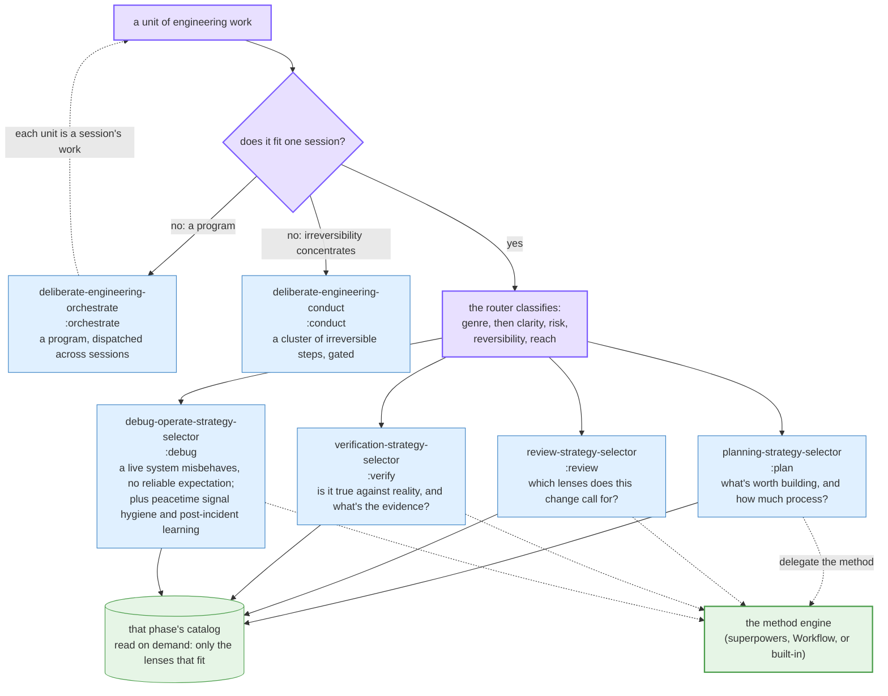
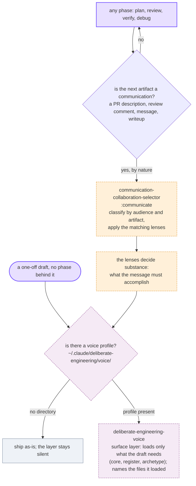
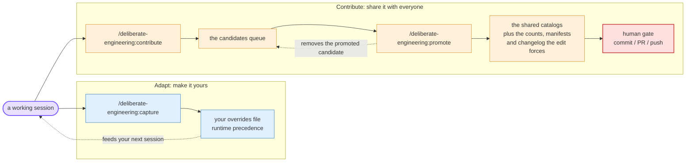

[deliberate-engineering](../README.md) › **Architecture & usage**

# Architecture & usage

This is the map and the manual for `deliberate-engineering`: what the pieces are, how they fit together, and how to drive each flow. It is written for two readers: the human adopting the plugin, and the agent running it (which reasons better from *what you're trying to do* than from a list of parts). For why the plugin is scoped the way it is, see the README's *Scope & boundaries*; for install and uninstall, see the [README](../README.md).

## How it fits together

The plugin is a thin layer of judgment over a workflow engine. The README's *What's inside* map shows the whole surface at a glance; this section explains each piece in turn and zooms into the parts a picture serves best: the four deliberate phases, communication and voice, and the extensibility cycle.

### The front door and the constitution

- **The rules are the constitution.** Nine standing postures held across every phase of engineering work, and the defaults you do not switch off casually. You can override them deliberately: an operator override can loosen even a safety rule, which the plugin honors while announcing the raised autonomy. They set *how you behave*; everything below sets *where you start and what you do*.
- **The router is the front door** (`/deliberate-engineering:start`). Before classifying anything it checks the altitude: a program too large for one session goes to orchestration, a concentrated cluster of irreversible steps goes to conduction, and only work that fits one session stays here. Then it classifies, names the phase sequence and the ceremony each phase earns, and routes (recommending, never forcing). The only hard stop is the Rule 1 human gate on an irreversible or outward-facing action. At each phase transition it writes a short live note through the state skill below.
- **Four skills have no command, and are consulted rather than driven.** `deliberate-engineering-rules` is the constitution above, always in play and never invoked. `deliberate-engineering-voice` is the surface layer the communication selector reaches after the lenses have decided substance, and is described under *Communication and voice* below. `deliberate-engineering-overrides` reads your personal override file and applies it wherever a lens or standing rule is about to be used, declaring every deviation; what it cannot reach is the router's classification axes and its genre-to-phase map, which are architecture rather than content. `deliberate-engineering-state` owns the working-note that carries phase, sequence, ceremony band, chosen lenses and pendings across sessions; it writes that note to `.deliberate/state/` inside the repository once it confirms the path is VCS-ignored, which can mean adding that line to your `.gitignore`, and to `~/.claude/deliberate-engineering/state/` when it cannot. They are named here because a map that only listed the commands would leave them invisible, and one of them writes to your repository.
- **Orchestration is its across-session sibling** (`/deliberate-engineering:orchestrate`). When the work is a program too large for one session, it runs an orchestration session that decomposes the work into units, dispatches each to a fresh worker session (a background subagent only for a narrow, earned band), verifies each return against primary evidence in a separate context, dispositions it, and tracks the whole program behind an always-current recovery anchor that lets any fresh session resume the orchestrator, committing that tracker to its own repository as each disposition lands. The router conducts phases *within* a session; this orchestrates units *across* sessions. It is deliberately thin: it cites the standing rules and reuses the selectors and the state working-note rather than restating them, and it stops at the same Rule 1 gate for every outward action a unit produces.
- **Conduction is its sibling for irreversibility clusters** (`/deliberate-engineering:conduct`). When irreversibility concentrates into a cluster (a merge cascade, a deploy chain, a batch of production data mutations, a teardown), it runs the cluster from a CONDUCTOR contract: a fixed step order with a gate between each, world state re-derived before every gate, the gate state kept in a per-item station table rather than in memory, each irreversible step bounded by a dry-run and a blast-radius limit before it fires and verified after, and every irreversible trigger handed to the operator (Rule 1). It writes a conductor doc for the cluster, committed to the tracker's repository when one is in play. The router conducts phases *within* a session, orchestrate units *across* sessions, and this conducts steps *across an irreversibility cluster*, usually in one. It cites the verification rollout and data-mutation lenses and the planning ordering lenses rather than restating them; a small cascade stays in a tracker queue, and a cluster earns its own cockpit only when the gate graph outgrows one.

### The four phases


```mermaid
flowchart TD
    work["a unit of engineering work"]
    altitude{"does it fit one session?"}
    orch["deliberate-engineering-orchestrate<br/>:orchestrate<br/>a program, dispatched across sessions"]
    cond["deliberate-engineering-conduct<br/>:conduct<br/>a cluster of irreversible steps, gated"]
    axes["the router classifies:<br/>genre, then clarity, risk,<br/>reversibility, reach"]
    plan["planning-strategy-selector<br/>:plan<br/>what's worth building, and how much process?"]
    review["review-strategy-selector<br/>:review<br/>which lenses does this change call for?"]
    verify["verification-strategy-selector<br/>:verify<br/>is it true against reality, and what's the evidence?"]
    debug["debug-operate-strategy-selector<br/>:debug<br/>a live system misbehaves, no reliable expectation;<br/>plus peacetime signal hygiene and post-incident learning"]
    catalog[("that phase's catalog<br/>read on demand: only the lenses that fit")]
    engine["the method engine<br/>(superpowers, Workflow, or built-in)"]

    work --> altitude
    altitude -->|"no: a program"| orch
    altitude -->|"no: irreversibility concentrates"| cond
    altitude -->|yes| axes
    orch -.->|each unit is a session's work| work
    axes --> plan
    axes --> review
    axes --> verify
    axes --> debug
    plan --> catalog
    review --> catalog
    verify --> catalog
    debug --> catalog
    plan -.->|delegate the method| engine
    review -.-> engine
    verify -.-> engine
    debug -.-> engine

    classDef entry fill:#e8e0ff,stroke:#7c5cff,stroke-width:2px;
    classDef phase fill:#e0f0ff,stroke:#3b82c4,stroke-width:1px;
    classDef store fill:#e6f5e6,stroke:#4a9d4a,stroke-width:1px;
    classDef engine fill:#e6f5e6,stroke:#4a9d4a,stroke-width:2px;
    class work,altitude,axes entry
    class plan,review,verify,debug,orch,cond phase
    class catalog store
    class engine engine
```

- **The four phases share one pattern:** classify the work, then read only the lenses that fit from that phase's catalog (never the whole catalog at once). Planning decides what to build; review reasons about the artifact; verification confronts reality; debug/operate takes over when a live system misbehaves and no reliable expectation holds, and also owns the peacetime band that keeps those signals worth trusting and the retrospective that follows an incident.
- **They share one ruler, not one set of axes.** Every phase measures depth by *the cost of being wrong, not the size of the change*, and that ruler is the single mental model. What each phase classifies *on* is its own and differs where the epistemic mode differs: plan and review use the router's four (clarity, risk, reversibility, reach); verification asks what kind of evidence the claim needs and how costly a false "it's fine" would be, since the expectation is already stated by the time it fires; debug/operate opens by asking whether a reliable expectation exists at all, because it starts where none does. Each selector states its own classification step, so a router classification never stands in for the phase's own.
- **The method is delegated.** A workflow engine owns *how* the work is carried out: `superpowers` (TDD, systematic debugging, plan execution) is the one recommended and the Workflow tool handles orchestration, but the layer delegates to whatever engine is present, falling back to the agent's built-in abilities when none is. The plugin owns the judgment (which phase, which lenses, how much ceremony) and hands the mechanism to the engine.

### Communication and voice


```mermaid
flowchart TD
    phase["any phase: plan, review, verify, debug"]
    artifact{"is the next artifact a communication?<br/>a PR description, review comment, message, writeup"}
    comms["communication-collaboration-selector<br/>:communicate<br/>classify by audience and artifact,<br/>apply the matching lenses"]
    substance["the lenses decide substance:<br/>what the message must accomplish"]
    voice{"is there a voice profile?<br/>~/.claude/deliberate-engineering/voice/"}
    silent["ship as-is; the layer stays silent"]
    profile["deliberate-engineering-voice<br/>surface layer: loads only what the draft needs<br/>(core, register, archetype); names the files it loaded"]

    oneoff(["a one-off draft, no phase behind it"])

    phase --> artifact
    artifact -->|no| phase
    oneoff --> voice
    artifact -->|yes, by nature| comms
    comms --> substance
    substance --> voice
    voice -->|no directory| silent
    voice -->|profile present| profile

    classDef entry fill:#e8e0ff,stroke:#7c5cff,stroke-width:2px;
    classDef comms fill:#fff0d9,stroke:#e0962e,stroke-width:1px,stroke-dasharray:4 2;
    classDef voice fill:#f5eaf5,stroke:#9c5c9c,stroke-width:1px,stroke-dasharray:4 2;
    classDef plain fill:#eef2f7,stroke:#7c8aa0,stroke-width:1px;
    class phase,oneoff entry
    class comms,substance comms
    class voice,profile voice
    class silent plain
```

- **Communication is cross-cutting, not a phase.** When the artifact you're producing is a communication (a PR description, a review comment, a stakeholder message, a writeup of alternatives), the router routes it *by nature* to `communication-collaboration-selector`, which classifies by audience and artifact (its own axes, not the router's routing axes) and applies its seven lenses. You consult it from inside whatever phase you're in; it never becomes a fifth phase and adds no fifth axis. Once the lenses have shaped the message, the selector consults `deliberate-engineering-voice` for every human reader other than the operator, and never for the **code-agent** audience, where a personal register would corrupt output a tool has to parse; an optional surface layer that applies your personal voice profile over the result (the lenses decide what the message must accomplish, the profile decides how it sounds) and names the files it loaded; with no profile directory it does nothing and says nothing.

### The extensibility cycle


```mermaid
flowchart LR
    session(["a working session"])

    subgraph adapt["Adapt: make it yours"]
        direction LR
        capture["/deliberate-engineering:capture"]
        overrides["your overrides file<br/>runtime precedence"]
        capture --> overrides
    end

    subgraph share["Contribute: share it with everyone"]
        direction LR
        contribute["/deliberate-engineering:contribute"]
        queue["the candidates queue"]
        promote["/deliberate-engineering:promote"]
        catalog["the shared catalogs<br/>plus the counts, manifests<br/>and changelog the edit forces"]
        gate["human gate<br/>commit / PR / push"]
        contribute --> queue --> promote --> catalog --> gate
        promote -.->|removes the promoted candidate| queue
    end

    session --> capture
    session --> contribute
    overrides -.->|feeds your next session| session

    classDef session fill:#e8e0ff,stroke:#7c5cff,stroke-width:2px;
    classDef adopter fill:#e0f0ff,stroke:#3b82c4,stroke-width:1px;
    classDef author fill:#fff0d9,stroke:#e0962e,stroke-width:1px;
    classDef gate fill:#ffe0e0,stroke:#cc4444,stroke-width:2px;
    class session session
    class capture,overrides adopter
    class contribute,queue,promote,catalog author
    class gate gate
```

- **Your overrides file is the personal layer.** Read at runtime, it takes precedence over any shipped lens or rule; when it changes what the agent does, the agent says so. `/deliberate-engineering:capture` grows that file for you, reading the full session transcript from disk (your typed messages, extracted to a temporary directory it does not delete) and distilling it into ready-to-paste blocks.
- **The author tools grow the shared catalogs.** `/deliberate-engineering:contribute` generalizes a session's judgment into a candidate (dropping anything that can't be said without the specifics) and `/deliberate-engineering:promote` runs a blocking leak-audit, edits the catalog append-only, and follows that edit through everything it forces: the selector that routes the new lens, the counts stated in the README and in this document, both version manifests, the CHANGELOG, and the deletion of the promoted candidate from the queue. Both stop at the human gate: they edit only the working tree and never commit, open a PR, or push. That last step is always yours (Rule 1).

## How to use it

The step-by-step walkthroughs live in the **[guides](guides/README.md)**; start from the by-situation index there. The short map, by intent:

- **Use**: [The deliberate flow](guides/deliberate-flow.md): the everyday journey through `/deliberate-engineering:start`, the four phases (`:plan`, `:review`, `:verify`, `:debug`), and the cross-cutting `:communicate`, with a per-command reference table.
- **Scale**: [Orchestrate](guides/orchestrate.md) runs a program too large for one session as dispatched units with one authoritative tracker; [Conduct](guides/conduct.md) runs a cluster of irreversible steps in a fixed, gated order where you pull every trigger.
- **Adapt**: [Capture](guides/capture.md) turns a session's corrections into your personal overrides; [Voice-build](guides/voice-build.md) builds your voice profile from your own writing. The formats they rely on are in the sections below.
- **Contribute**: the author flow (a lens for everyone) lives in [CONTRIBUTING.md](../CONTRIBUTING.md).

One mental model runs across all of them, and it is the ruler rather than a shared set of axes: the cost of being wrong decides the depth, never line count (each phase classifies on its own axes, as above). The plugin recommends a depth and a set of lenses *with its reasoning*, and you stay in control. Two things are not left to that discretion: it stops at a human gate before any irreversible or outward-facing action (a merge, a deploy, a push, a posted message), and it writes its place to the live note at each checkpoint rather than trusting recall. Everything else is recommended and yours to overrule. The nine standing rules hold underneath every phase the whole time.

### Adapt: make it think like you

The plugin is opinionated, and it's meant to become yours. A personal file at `~/.claude/deliberate-engineering/overrides.md` takes precedence over the shipped content it can address, which is the named lenses and the standing rules; the router's four routing axes and its genre to phase-sequence map are architecture and stay out of reach. Entries are addressed by stable identifiers: `review #N`, `verify #N`, `planning #N`, `debug #N`, `communication #N`, or `Rule N`. Three operations: `disable` turns a lens or rule off; `modify` appends your annotation alongside the shipped text; `add` defines your own. The agent always declares when an override changed what it did (nothing happens silently), and you can even loosen a safety rule, which it honors while calling out the raised autonomy. The numbers are the headings in the catalogs themselves, which is where to look one up before writing an entry by hand: [review](../plugins/deliberate-engineering/skills/review-strategy-selector/catalog.md), [verification](../plugins/deliberate-engineering/skills/verification-strategy-selector/catalog.md), [planning](../plugins/deliberate-engineering/skills/planning-strategy-selector/catalog.md), [debug/operate](../plugins/deliberate-engineering/skills/debug-operate-strategy-selector/catalog.md), [communication](../plugins/deliberate-engineering/skills/communication-collaboration-selector/catalog.md).

You can write that file by hand, or let the agent help: run `/deliberate-engineering:capture` (or just ask) and it distills the session you just had (the lenses you skipped or corrected, the practices the catalog lacks) into ready-to-paste blocks. On demand only, append-only, written only on your approval. This grows *your* file; it is the adopter's side, distinct from the author tools below. The walkthrough is the [capture guide](guides/capture.md).

**Example override file:**

```markdown
## review #35: disable

**Why:** We run a separate simplification pass after the deliberate review; not needed in the main pass.

## add: review

**Name:** API backward-compatibility check (no breaking signature changes without major version bump)

**When:** The change modifies a public API surface (REST endpoints, library exports, gRPC contracts)

**Apply:** Review the diff for any breaking changes (removed endpoints, changed request/response shapes, deleted fields). If a breaking change is present and the version is not a major bump, flag it. Non-breaking additions (new optional fields, new endpoints) are fine.
```

Overrides are one of four things the plugin keeps under `~/.claude/deliberate-engineering/`, all opt-in and all absent by default: the override file, the voice profile, the state notes it falls back to when a repository cannot host them, and the working directory a voice build uses. The override file changes *what the agent does*; the voice profile changes *how what it writes sounds*. The profile is a directory at `~/.claude/deliberate-engineering/voice/`: `core.md` for what's true of your writing everywhere, `registers/<lang>.md` for what changes with the language, `archetypes/<type>.md` for what changes with the kind of communication (a DM is not a design doc). `deliberate-engineering-voice` normally reads it after the communication lenses have shaped the message, and applies it as the surface layer; it is also reachable directly for a one-off draft with no phase behind it, loading at most three files per draft (the core, the matching register, the matching archetype) and falling back to two, declared, when one has no match. Precedence runs explicit instruction > voice profile > default style; where a lens and the profile genuinely conflict, the lens wins on substance and the profile wins on surface. It names the files it loaded when it fires, it never licenses breaking a standing rule (the Rule 1 gate and the Rule 9 resolvability bar hold regardless of how you write), and it does nothing and says nothing when the directory is absent. The plugin ships the mechanism, the contract, a template, a bootstrap method, and a guided build path (`deliberate-engineering-voice-build`, the `/deliberate-engineering:voice-build` command, which runs that method from collection to a finished profile and keeps the interview and the blind A/B human); no profile content ships, and the corpus and the profile are kept out of every repository by a best-effort check the build runs, it declines to write where it cannot confirm the path is out of a repository, and it cannot enforce that: an agent can ignore an instruction and nothing outside it blocks the write: it lowers the risk of a leak rather than removing it. The README's *Sound like yourself* section is the overview; `contract.md` next to the skill is the full layout; the walkthrough is the [voice-build guide](guides/voice-build.md).

### Contribute: ship judgment to everyone

When a session surfaces judgment that generalizes beyond you, it can become a catalog lens for everyone. Two steps, with a hard wall between them and the public:

- `/deliberate-engineering:contribute` turns that judgment into a candidate. Its central act is *generalize at capture*: it extracts the employer-neutral principle and discards the specifics (services, incidents, names) before anything is written. Anything that can't survive that, it drops rather than half-cleans. Approved candidates land as `pending` files in the `candidates/` queue, created on first use inside the plugin's own clone rather than in the project you are working on.
- `/deliberate-engineering:promote` drives a candidate into the catalog: a blocking leak-audit first (any surviving specific stops it), then an append-only edit (a new lens gets the next free number and existing lenses are never renumbered, so the override identifiers you cite stay stable), the routing that makes the new lens reachable from its selector, a skill-reviewer pass, the count and manifest updates that edit forces, and the removal of the candidate it promoted. A structural change (a new catalog, a reorganization, a rule change) is not auto-applied; promote recommends the full design cycle instead.

Both tools edit only the working tree and always stop before commit, PR, or push: publication is your decision (Rule 1). For the contributor workflow end to end, see [`CONTRIBUTING.md`](../CONTRIBUTING.md).

### Where to go next

- The step-by-step walkthroughs, by situation: the [guides index](guides/README.md).
- Install, uninstall, and the optional always-on recipe live in the [README](../README.md).
- The exact override-file format and an example are in *Adapt: make it think like you* above.
- Why the plugin stays horizontal and where it stops is the README's *Scope & boundaries* section.
