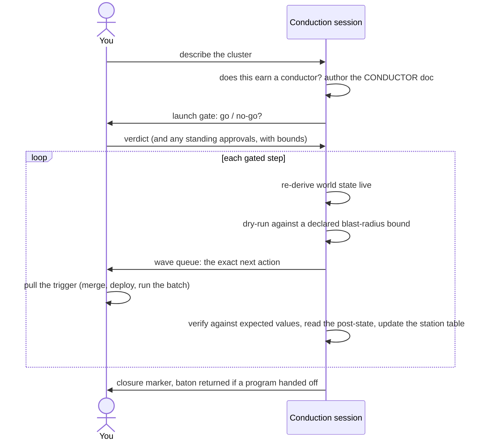

[deliberate-engineering](../../README.md) › [Guides](README.md) › **Conduct**

# Conduct: run an irreversibility cluster

`/deliberate-engineering:conduct` is for the moment irreversibility concentrates: a merge cascade, a deploy chain, a batch of production data mutations, a teardown. Steps that must fire in a fixed order, each gated behind a verification of the last, where the cost of a slipped gate is real. The agent conducts; **you pull every irreversible trigger**.

## When to reach for it, and when not

Use it when a *cluster* of irreversible steps must fire in a fixed, gated order. Not for a single irreversible step: Rule 1's ordinary human gate already covers that. Not for dispatching a program of work across sessions: that is [orchestrate](orchestrate.md). And not every cascade earns it: a small two-or-three-step sequence stays in the program tracker's operator queue (when an [orchestration](orchestrate.md) is carrying it) or simply runs inline in your session under Rule 1's ordinary per-step gate; a cluster earns its own conductor only when the gate graph outgrows that.

"Irreversible" here is Rule 1's sense: outward-facing and costly to undo. A merge cascade qualifies even though git can technically revert it; the contract marks separately the point where rollback becomes truly impossible.

## The mental model

A conduction has two beats. First the cluster gets its **contract**: a single CONDUCTOR doc that inventories the steps, fixes the order and why, places the gates, names the keystone and the point of no return, and declares the recovery path. Only then does conduction begin: step by step, world state re-derived before every gate (never trusted from memory), each irreversible action queued for you, each result verified against a stated expectation before the next step may fire. The conductor doc is the live cockpit until the cluster closes. There are no dispatched workers: one operator, one agent, one ordered cluster, usually one session.

## The walkthrough

1. **[You]** Invoke `/deliberate-engineering:conduct` with the cluster ("the 4-repo deploy chain", "the user-table backfill"), or arrive here because the router or an orchestration handed the cluster over.
2. **[Agent]** Judges whether the cluster earns a standalone conductor at all, and says so either way. A small cascade stays where it was: in the program tracker's queue if an orchestration carries it, or inline in your session with the ordinary gate on each step; no doc, no ceremony.
3. **[Agent]** Authors the CONDUCTOR doc from the contract: the done inventory with keystone and point of no return, the gated groups with the reason the order is fixed, the verified recovery path and the emergency abort, the per-item station table (gate state lives in checkboxes, never in memory: in the field, the one gate kept only as a reminder is the one that slips).
4. **[You]** Grant any standing approvals and their bounds ("you may rebase without asking; every merge is mine"), and give the launch-gate verdict: go / no-go. The launch gate is required once the cluster has a point of no return.
5. **[Agent]** Before each irreversible step: re-derives the world state live, runs the dry-run or shadow read against a pre-declared blast-radius bound with an abort threshold.
6. **[Agent → You]** Queues the exact next action in the operator wave queue, with the division of labor inline ("I rebase, you merge"). **[You]** pull the trigger.
7. **[Agent]** After the step: runs the between-step verification battery against expected values stated in advance (never a bare exit code), reads the post-state to confirm the write landed (core for a data mutation), and updates the station table. A check that misses its expected value stops the line: the verdict is recorded (pass / hold / fail), nothing advances, and the recovery path or the abort comes to you as the next queued decision.
8. Repeat 5–7 down the fixed order. **[You]** can call a **hold** (a planned pause with the explicit condition or time that releases it, so it cannot rot into a silent block) or an **abort** (an emergency stop to a named safe state) at any point.
9. **[Agent]** On interruption, writes the session residue: live state, the exact next action, any half-taken step and its re-run safety, so a fresh session resumes without trusting anyone's memory. To resume, re-invoke `/deliberate-engineering:conduct` and point it at the CONDUCTOR doc; the residue section is its entry point.
10. **[Agent]** At completion: the closure marker and the closeout obligations; if a program handed the cluster off, the conduction session updates the tracker so the baton returns.

## Artifacts

| Artifact | Written by | Lives |
|---|---|---|
| The CONDUCTOR doc (inventory, gated groups, station table, wave queue, residue, closure marker) | Conduction session, updated as the cluster advances | Wherever you keep it; a `CONDUCTOR.md` next to the work is a fine default, and the agent proposes one if you have no convention. The plugin ships the contract, the filled-in doc is yours (inside an orchestrated program, the tracker holds the pointer) |

## Composing with the rest

- **With [orchestrate](orchestrate.md):** the baton-pass, in both directions. When irreversible steps concentrate inside an orchestrated program, the tracker goes quiet and points at the conductor; at closure the baton returns. One live cockpit at a time: a conduction never fans work out to worker sessions.
- **With the router:** a rollout that concentrates into a cluster gets routed here; scattered release steps that never concentrate stay with the ordinary planning and verification lenses.

## Where to go next

- The full field-level contract: [the skill's `templates.md`](../../plugins/deliberate-engineering/skills/deliberate-engineering-conduct/templates.md) (with example station sets for a git rollout, a data batch, and a teardown)
- A whole program around your cluster → [Orchestrate](orchestrate.md)
- Back to [the guide index](README.md)
