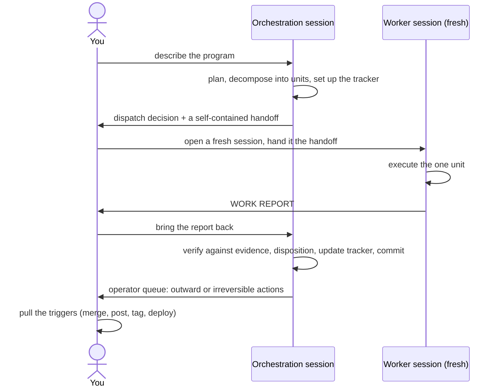

[deliberate-engineering](../../README.md) › [Guides](README.md) › **Orchestrate**

# Orchestrate: run a program across sessions

`/deliberate-engineering:orchestrate` is for a program genuinely too large for one context: the work gets decomposed into self-contained units, each unit executes in its own fresh session, and one orchestration session keeps the judgment and the record. What it buys is parallelism without blocking, human control, and human visibility, not labor saving: you stay in the loop as the relay between sessions, on purpose.

## When to reach for it, and when not

Use it when the program's units will genuinely execute in **separate sessions**. Skip it for anything that fits one session, including single-session work you only want to parallelize into subagents: that routes through [the deliberate flow](deliberate-flow.md) directly. And when a cluster of irreversible steps concentrates inside the program (a merge cascade, a deploy chain), the orchestrator hands that cluster to [conduct](conduct.md) and takes it back when the cluster closes.

## The mental model

One session orchestrates; it does not execute. It plans, decomposes, dispatches, verifies what comes back, and keeps the tracker true. Workers execute exactly one unit each and end. By default **you are the mechanical relay between them**: sessions do not message each other, by design, so every handoff and every report crosses through your hands, and you stay able to watch and intervene. The relay is a candidate to shed as trust converges; the judgment and the gates never are.

## The walkthrough

1. **[You]** Create a dedicated private git repo as the home for the program's state. The orchestration session creates `tracker.md`, `handoffs/`, and `reports/` in it as the program needs them (start flat: no pre-built folder taxonomy, structure only when a folder overflows). Scrub or gitignore any credential before committing, especially once the repo is synced. The tracker is the single authoritative record; one commit per disposition becomes the audit trail.
2. **[You]** Open the orchestration session in the tracker repo and invoke `/deliberate-engineering:orchestrate`, describing the program in the same message: the goal, the units you already see, where the work lives.
3. **[Agent]** Plans and decomposes into units, writes the tracker with a recovery anchor (the always-current pointer that lets any fresh session resume the orchestrator role).
4. **[Agent]** Per unit, makes the dispatch decision out loud: trivial or tightly coupled units run **inline**; the default for real units is a **fresh, human-watched session**; a narrow, explicitly-earned band goes to a background subagent, with the earning conditions declared out loud. You approve the dispatch.
5. **[Agent]** Authors the handoff: a self-contained prompt, premise frozen against a live read of the world at dispatch time, saved under `handoffs/`. It must be resolvable by a session holding only the handoff, so it carries everything the worker needs.
6. **[You]** Open a fresh session where the unit's work lives (the handoff names it) and hand it the handoff: point it at the handoff file by path, or paste the content. Watch it work; intervene when needed.
7. **[Agent, worker]** Executes the one unit (running its own phases and gates as the work demands) and produces a **work report**: what was done, the evidence, what was deliberately not done. You are the relay: file it under `reports/` in the tracker repo, or ask the worker to write it there when it knows the path. The worker is then done; follow-ups become new handoffs, never a reopened session.
8. **[You]** Bring the report back to the orchestration session (point at the file or paste it).
9. **[Agent]** Verifies the report's claims against primary evidence (re-verifying contested or high-stakes claims in a separate context), dispositions it (accept / reject / follow-up), updates the tracker, and commits the disposition.
10. **[You]** Work the operator queue: everything outward or irreversible (post, merge, tag, deploy) waits there for your trigger (Rule 1: the human's hand stays on every irreversible or outward-facing action).
11. Repeat 4–10 until the program closes; several units can be in flight at once (each worker is its own session), with reports returning and being dispositioned one at a time. Gaps you caught along the way can flow into [capture](capture.md) (your overrides) or the [contribution queue](../../CONTRIBUTING.md).

**Resuming:** the orchestration session itself is disposable. To resume, open a fresh session in the tracker repo, invoke `/deliberate-engineering:orchestrate`, and tell it to resume from the tracker: it re-reads the recovery anchor before doing anything else. A long-lived orchestration session is an optimization, never a requirement.

## Artifacts

| Artifact | Written by | Lives |
|---|---|---|
| Program tracker (with recovery anchor, per-stream status, operator queue, done log) | Orchestration session | Your tracker repo, `tracker.md` |
| Handoff (the outbound contract, one per unit) | Orchestration session | `handoffs/` |
| Work report (the inbound contract, one per unit) | Worker session | `reports/` |
| Disposition commits (the audit trail) | Orchestration session | The tracker repo's history |

The plugin ships the templates for all three documents (see the skill's `templates.md`); the filled-in instances are yours and stay in your private tracker repo.

## Composing with the rest

- **With [conduct](conduct.md):** when irreversible steps concentrate into a cluster, the tracker goes quiet and holds a pointer to the conductor; the conductor becomes the single live cockpit; the baton returns to the tracker at the cluster's closure. One live cockpit at a time.
- **With [capture](capture.md) / [CONTRIBUTING](../../CONTRIBUTING.md):** operator-caught gaps route into your overrides or the shared catalog as part of the loop.
- `deliberate-engineering-state` delegates to the tracker while a program runs: the tracker is the one source of truth, never a second store beside it.

## Where to go next

- The full field-level contracts (handoff, report, tracker): [the skill's own `templates.md`](../../plugins/deliberate-engineering/skills/deliberate-engineering-orchestrate/templates.md)
- An irreversibility cluster inside your program → [Conduct](conduct.md)
- Back to [the guide index](README.md)
