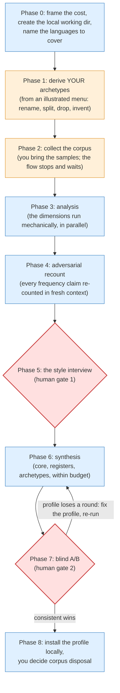

[deliberate-engineering](../../README.md) › [Guides](README.md) › **Voice-build**

# Voice-build: build your voice profile from your own writing

`/deliberate-engineering:voice-build` is the guided, resumable path from zero to a voice profile: the local package that `deliberate-engineering-voice` later loads to make drafts sound like you instead of like a default LLM register. The flow structures the collection, runs the mechanical analysis, and keeps the two steps that genuinely need your judgment in your hands.

Set expectations first: this is a project across sessions, not one sitting, and collecting the corpus of your own real writing is most of the cost. The flow is built to be paused and resumed; its manifest keeps the durable state, so "resume collection" weeks later is a normal move, not an exception.

## When to reach for it, and when not

Reach for it when you want a profile and don't have one. Applying an existing profile to a draft is `deliberate-engineering-voice`, not this; folding new samples into an existing profile incrementally is a future extension, not this. Everything stays local: the corpus and the finished profile live on your machine and never enter a repository.

## The mental model

## The walkthrough

1. **[You]** Invoke `/deliberate-engineering:voice-build` ("start collection", "resume", "just the interview" all work as entries).
2. **[Agent]** Frames the cost honestly, creates a local working directory (default `~/.claude/deliberate-engineering/voice-build/`, outside any repo, with a safety check), and asks which languages the profile must cover.
3. **[You + Agent]** Derive *your* archetype set: the agent teaches what an archetype is and presents a suggested menu (DM, channel, work item, code review, design doc, email, calendar, social post, article); you rename, split, drop, and invent until the set is yours.
4. **[You]** Collect the corpus. Buckets are archetype × language, era-tagged, with floors per bucket; the flow stops and waits until the floors are met, across as many sessions as it takes. Representative beats curated: the rushed one-liners belong in the corpus precisely because they are how you actually write.
5. **[Agent]** Runs the analysis dimensions over the corpus (the independent ones in parallel), then the adversarial recount: every frequency claim re-counted in a fresh context, and anything the count doesn't support gets downgraded before it can become a rule.
6. **[You — human gate 1]** The style interview. Questions built from the findings, put to you one at a time, and the agent never answers on your behalf: this is where deliberate habit gets separated from accident.
7. **[Agent]** Synthesizes the profile within the contract's size budget: `core.md` (what holds everywhere), `registers/<lang>.md` (what changes with language), `archetypes/<type>.md` (what changes with the artifact), every rule carrying its citation.
8. **[You — human gate 2]** The blind A/B. For each archetype: a blind draft (generated in a fresh session that was never told a profile exists) against a profile draft; you pick and critique before the labels are revealed. When the profile loses, the *profile* gets fixed, not the draft, and rounds continue until it wins consistently against a pass bar fixed before round one.
9. **[Agent]** Installs the finished profile at `~/.claude/deliberate-engineering/voice/`; **[You]** decide what happens to the corpus (delete, or keep locally; it never enters a repo).

From then on, `deliberate-engineering-voice` loads the profile automatically whenever a draft goes out in your name, and names the files it loaded.

## Artifacts

| Artifact | Written by | Lives |
|---|---|---|
| Collection manifest (the authoritative resume state) | The flow | `~/.claude/deliberate-engineering/voice-build/` |
| Corpus samples (typed, era-tagged) | You | Same working dir; disposal is your call at the end |
| The voice profile (`core.md`, `registers/`, `archetypes/`) | Synthesis, validated by your two gates | `~/.claude/deliberate-engineering/voice/` |

The profile format lives in the voice skill's `contract.md`; the underlying method in its `bootstrap.md` (both under `plugins/deliberate-engineering/skills/deliberate-engineering-voice/`). This flow runs that method for you; the documents remain the reference.

## Where to go next

- What the profile does at draft time: the *Sound like yourself* section of the [README](../../README.md)
- Personalize the agent's *judgment* too → [Capture](capture.md)
- Back to [the guide index](README.md)
